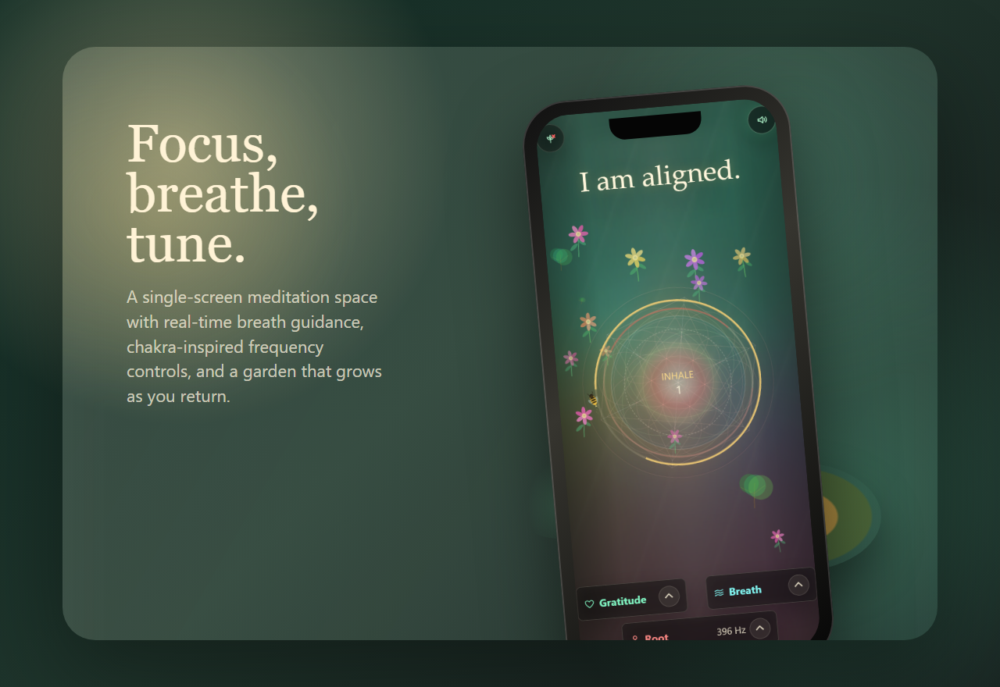
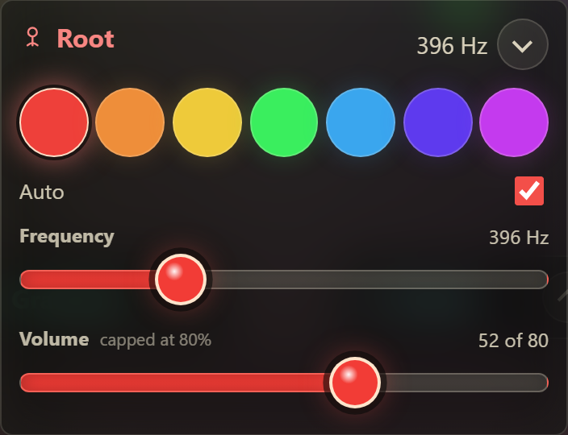
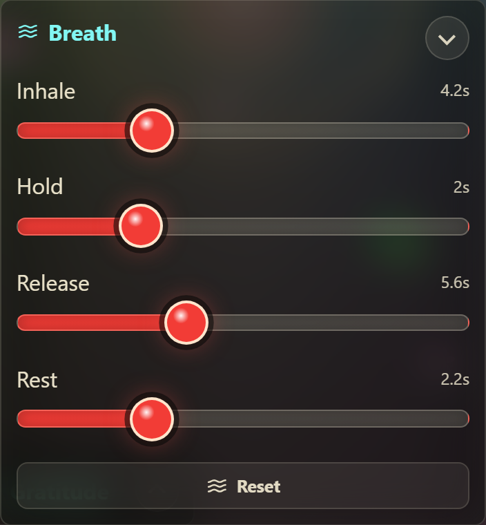
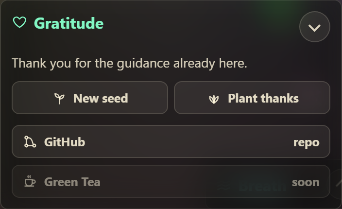
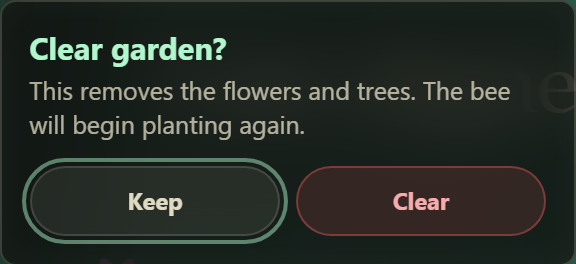
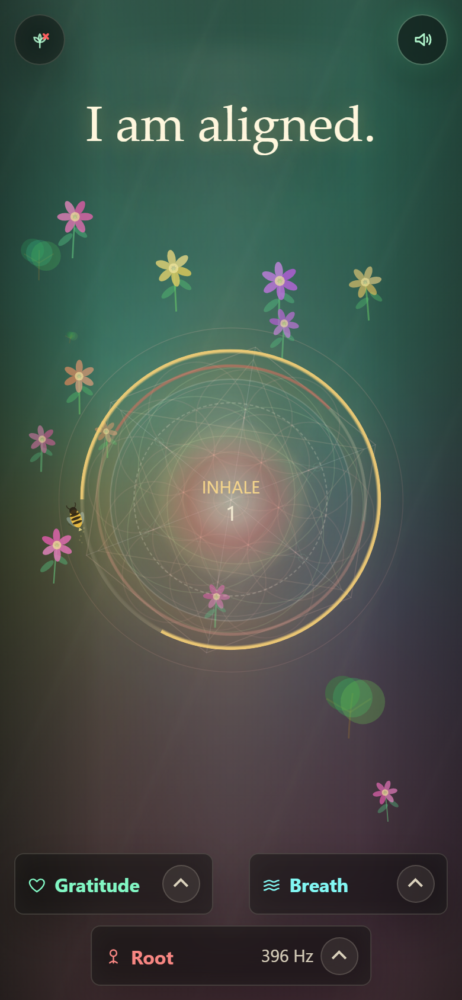
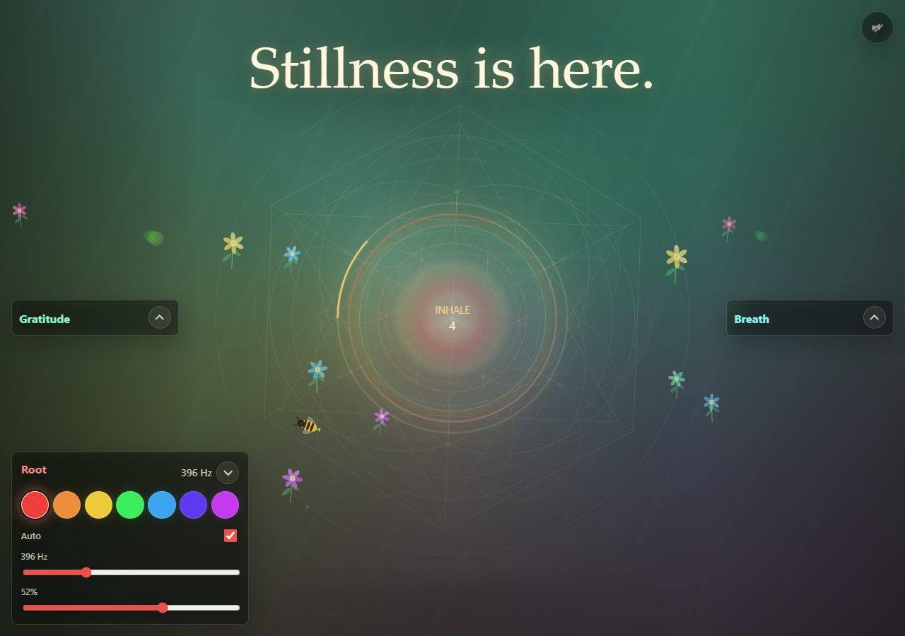

# Manifestation Meditation Page

**A living meditation web experience for breath, sound, gratitude, and focused intention.**

[Open the live experience](https://analysethatltd-hub.github.io/manifestation-meditation-page/)

<p align="center">
  
</p>

## A Quiet Product For Inner Focus

Manifestation Meditation Page is a single-screen ritual space designed to help the user settle, breathe, listen, and return attention to one clear inner signal.

It is intentionally not a dashboard, not a course, and not a content feed. The product is the moment itself: a large mantra, a centered breath guide, a living garden, soft sacred geometry, and a frequency layer that starts only when the user taps for sound.

## Product Highlights

- **Mantras as the centrepiece**  
  A 365-phrase mantra pool keeps the experience emotionally direct without getting stale too quickly.

- **Guided breathwork**  
  A fixed central breath circle guides inhale, hold, release, and rest without pulling the eye away from the focal point.

- **Desktop-quality sound on mobile**  
  The app uses browser-generated Web Audio for the frequency bed, ambient air, subharmonics, compression, and space. Mobile browsers require a tap, so the sound button is part of the designed ritual.

- **Chakra-inspired frequency tuning**  
  Root through Crown controls can auto-ascend or be manually tuned, with a deliberately capped volume range for calmer listening.

- **A living garden**  
  The bee scouts, darts, pollinates, plants flowers and trees, and slowly builds a garden that persists locally over time.

- **Playful interaction**  
  Tap near the bee and it reacts, darts away, and visibly agitates before returning to its pollinating work.

- **Gratitude and support controls**  
  Collapsible side panels keep gratitude, breath timing, GitHub, and Green Tea support available without cluttering the meditation view.

## Control Feature Close-ups

These images are captured from real app states and then presented as product assets. The controls shown here are the actual controls in `index.html`.

<table>
  <tr>
    <td width="50%" valign="top">
      
      <br>
      <strong>Frequency tuning</strong>
      <br>
      Choose a chakra colour, let the sequence auto-ascend, or manually tune the frequency and capped volume for a softer sound bed.
    </td>
    <td width="50%" valign="top">
      
      <br>
      <strong>Breath timing</strong>
      <br>
      Adjust inhale, hold, release, and rest while keeping the breathing circle fixed as the main visual anchor.
    </td>
  </tr>
  <tr>
    <td width="50%" valign="top">
      
      <br>
      <strong>Gratitude and support</strong>
      <br>
      Read a simple thank-you note, visit the GitHub repo, or buy a Green Tea through Ko-fi.
    </td>
    <td width="50%" valign="top">
      
      <br>
      <strong>Garden reset</strong>
      <br>
      Clear flowers and trees intentionally with confirmation, then let the bee begin planting again.
    </td>
  </tr>
</table>

## The Experience

<p align="center">
  
</p>

<p align="center">
  
</p>

## Mobile Sound

Mobile Safari and Chrome block audio until the visitor performs a clear user gesture. Use the top-right sound button or the `Tap for sound` prompt after the page loads.

If a phone has cached an older build, open the live page with a cache-busting URL:

```text
https://analysethatltd-hub.github.io/manifestation-meditation-page/?v=mobile-audio-bridge
```

## Built With

- Single static `index.html`
- CSS, Canvas, and browser Web Audio
- No build step
- No tracking
- No account system
- Local browser storage for garden persistence

## Local Preview

Run any small static server from the project folder:

```powershell
python -m http.server 4178
```

Then open:

```text
http://127.0.0.1:4178/index.html
```

## Green Tea Support

The Green Tea button inside the Gratitude panel is wired to:

```text
https://ko-fi.com/analysethat
```

The public app keeps the language in-theme while Ko-fi handles the support flow.

## Note

The frequency and chakra mappings are creative, experiential defaults rather than medical or spiritual claims. The product is designed as a contemplative focus object.
